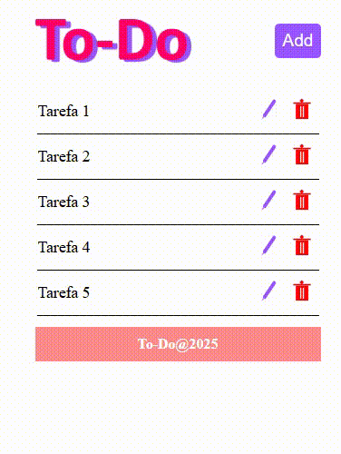

# To-Do

 

### I. Sobre o projeto

* Adiciona tarefas — Permite incluir novas tarefas na lista.

* Edita tarefas — Cada item pode ser modificado ao clicar no ícone de edição.

* Exclui tarefas — Remove tarefas individuais com o ícone de lixeira.

* Exibe lista organizada — Mostra todas as tarefas cadastradas de forma simples e visual.

### II. Pré-visualização

 

### III. Iniciar projeto

**/To-Do/backend >** 
npm start

**/To-Do/frontend/to-do/ >**
npm run dev

### IV. Contatos

* E-mail: [kba.2879@gmail.com](mailTo:kba.2879@gmail.com)

* Linkedin: [/katarine-albuquerque](https://www.linkedin.com/in/katarine-albuquerque/)
