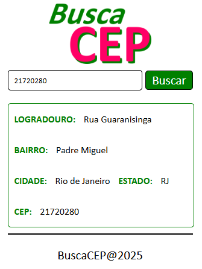
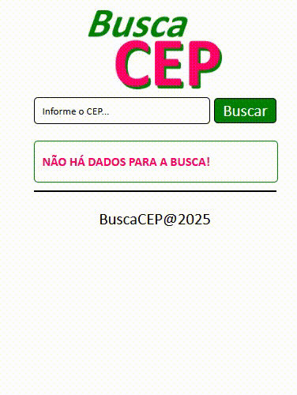

# Busca CEP

 

### I. Sobre o projeto

* Consulta CEP usando a BrasilAPI.

* Interface simples com campo e botão de busca.

* Exibe logradouro, bairro, cidade e estado.

* Busca dinâmica e rápida sem recarregar a página.

### II. Pré-visualização

 

### III. Configurar projeto

**/busca-cep >**
npm install

**/busca-cep >**
npm run dev

### IV. Contatos

* E-mail: [kba.2879@gmail.com](mailTo:kba.2879@gmail.com)

* Linkedin: [/katarine-albuquerque](https://www.linkedin.com/in/katarine-albuquerque/)
