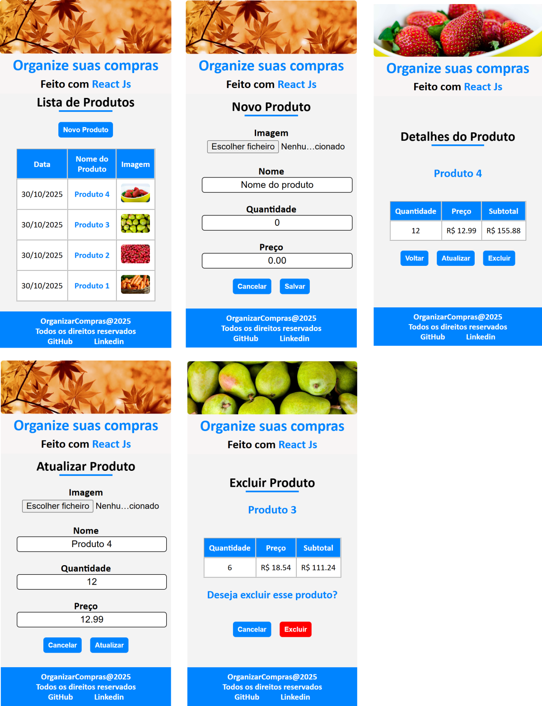

# Organizar Compras

### I. Sobre

- Cadastrar, listar, atualizar e excluir produtos com nome, quantidade, preço e imagem.
- Inclui upload de imagem.
- Exibe informações completas do produto e calcula o subtotal automaticamente.
- Interface moderna e responsiva, com navegação intuitiva entre as páginas.
- API que manipula os dados vindos do banco de dados MySQL.

### II. Imagens do projeto

### III. Configurações

Instalação das dependências do projeto:
- #### npm install

Rodar o projeto e suas dependências:
* #### npm run dev

### IV. Contatos

* E-mail: [kba.2879@gmail.com](mailTo:kba.2879@gmail.com)

* Linkedin: [/katarine-albuquerque](https://www.linkedin.com/in/katarine-albuquerque/)
