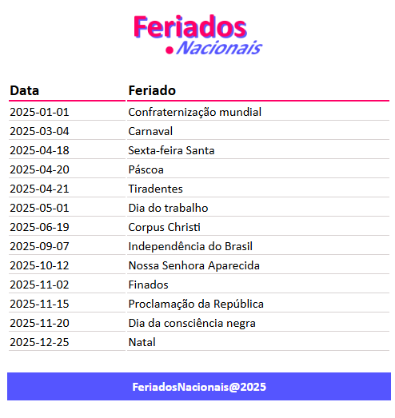

# Feriados Nacionais do Brasil

 

### I. Sobre o projeto

* Consulta Feriados usando a BrasilAPI.

* Interface simples que busca automaticamente pelo ano.

* Exibe data e nome do feriado.

* Busca dinâmica e rápida sem recarregar a página.

### II. Configurar projeto

**/feriados >**
npm install

**/feriados >**
npm run dev

### III. Contatos

* E-mail: [kba.2879@gmail.com](mailTo:kba.2879@gmail.com)

* Linkedin: [/katarine-albuquerque](https://www.linkedin.com/in/katarine-albuquerque/)
